# REST Chess solver

## Informacje dotyczące projektu

* Python 3.10
* Black (formatowanie)
* Flake8 (linter)
* Flask 1.0+
* Dozwolone jest używanie zewnętrznych bibliotek - chess

## Aby ukninąć przysłowiowego ponownego wynajdywania koła, wykorzystano bibliotekę chess

kolejnym powodem dla którego nie wynajdywałem gry w szachy od nowa było to, że **nie potrafię grać w szachy**

## Uwagi!

    [GET] `/api/v1/{chess-figure}/{current-field}` (wyświetla listę możliwych ruchów)
ten sposób walidacji możliwych ruchów nie jest dobry z paru powodów:

1. co jeżeli pionka nie ma na wybranym polu
1. skoro mamy stworzoną planszę to po co wybierać pionka skoro pionek przynależy do pola
1. pole ma w jednym momencie na sobie jednego pionka i wiadomo który pionek na nim stoi

## Tą metodę zastąpiono następującą

może być GET albo POST

        [GET/POST] `/api/v1/check/{current-field}`

metoda poruszania się pionkami

        [GET/POST] `/api/v1/{current-field}/{destination-field}`

## TUTORIAL

### WINDOWS

upewnij się że posiadasz potrzebne moduły
w scieżce gdzie znajduję się app.py wykonaj następujące polecenie

    pip install -r requirements.txt
jeżeli posiadasz wszystkie moduły możesz uruchomić aplikację

    python app.py [port]
#####przykład:
    python app.py 8080
**lub**
    
    python app.py

kiedy nie podamy portu domyślnie będzie to **5000**

## obowiązująca szachownica

]

## ułożenie pionków

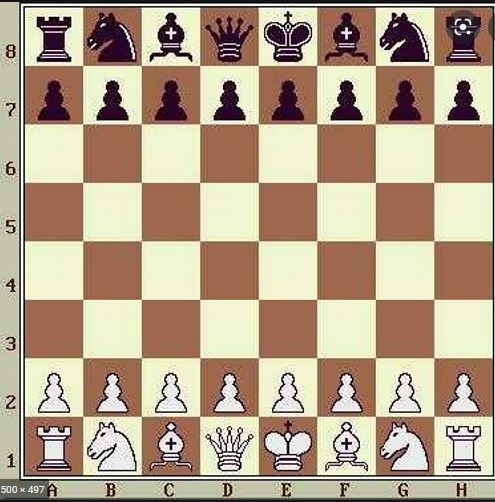]

## jak grać?

uruchomienie aplikacji, rozpoczyna rozgrywkę, zasady są takie same jak  w szachach
najłatwiej rozpocząć gre w przeglądarce

## 1. rozpocznij

odpowiedź serwera po komendzie:

     python app.py 8080
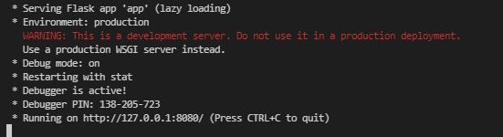]

## 2. otwórz przeglądarkę

## 3. sprawdź gdzie możesz poruszyć pionka z pozycji b2

    localhost:8080/api/v1/check/b2

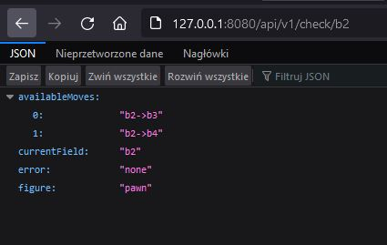]

jak widać mamy dwie opcje możemy nim przejść **z pola b2 na b3 albo b4**

## 4. przejdź tym pionkiem na pole b4

    localhost:8080/api/v1/b2/b4

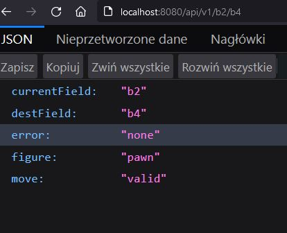]

udało się poruszyć na konsoli wyświetlił się również podgląd szachownicy

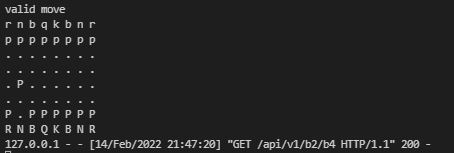]

spróbujmy ruszyć teraz tym samym pionkiem drugi raz co nie jest dozwolone

    localhost:8080/api/v1/b4/b5

]

wyświetla się komunikat o nie dozwolnych ruchu i response 409

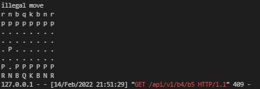]

## 5. ruch drugiego gracza pionem z f7

**sprawdźmy jakie mamy opcje**
    
    localhost:8080/api/v1/check/f7

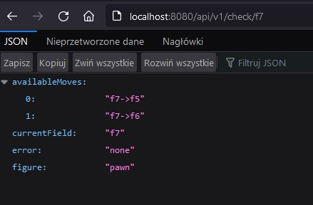]

**> rusz nim na f6**

localhost:8080/api/v1/f7/f6

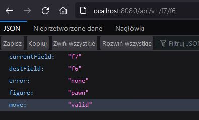]

**oraz podgląd na stan gry w konsoli**

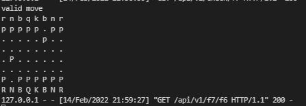]

## co sie wydarzy jak wybierzemy pole na którym nie ma pionka ?

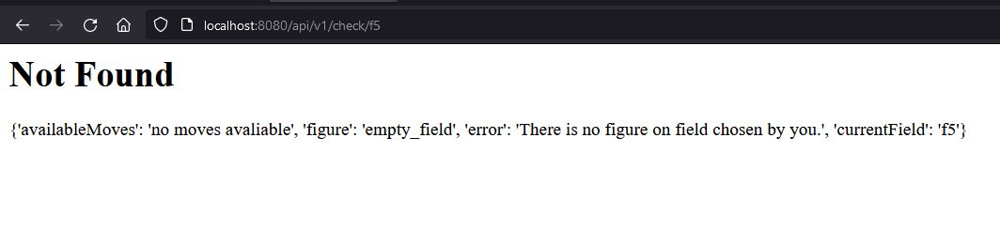]

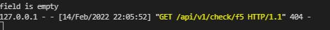]

## kontakt
**natanlisowski@gmail.com**
